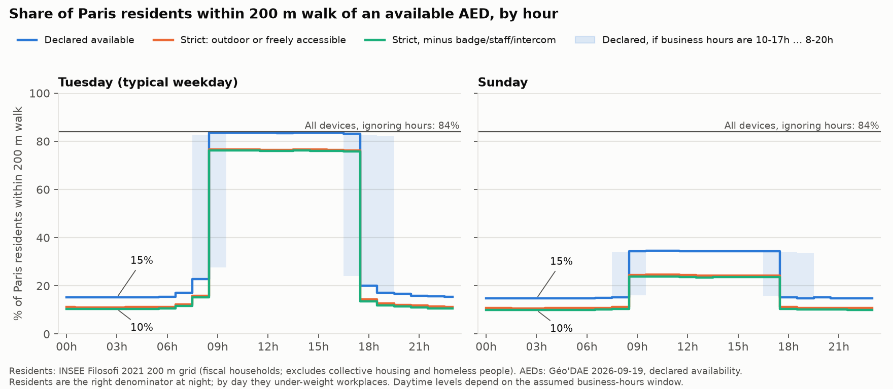

# Paris defibrillators: the night gap

**Question.** What share of Paris is within walking reach of a defibrillator (AED) at 3am compared with
daytime, and where would new 24/7 outdoor units close the gap fastest?

**Short answer.** At 3am on a typical weekday, **10–15% of Paris residents** have an AED that is declared
available within a 200 m walk, against **76–84% at noon**. That leaves about **1.7 million of 1.98 million
residents** with no reachable AED at night. 200 well-placed new 24/7 outdoor units would raise night
coverage to about **44%** — a large improvement that still leaves more than half of residents uncovered.

Everything here is built from official open data and is reproducible from scratch. Numbers are labelled
**verified** (counted from the data), **declared** (what AED operators state, never checked on the ground)
or **estimated** (depends on an assumption stated in the text).



## Headline results

Share of Paris residents within a 200 m walk of an available AED (Tuesday):

| Scenario | 03h | 12h | Status |
|---|---|---|---|
| **declared** — operator says it is available then | 15.2% | 83.5% | night: declared · day: estimated |
| **strict** — declared, and outdoor or marked freely accessible | 11.1% | 76.5% | night: declared · day: estimated |
| **strict-unconditional** — strict, minus badge/staff/intercom devices | 10.4% | 76.1% | night: declared · day: estimated |
| all devices, ignoring opening hours | 84.0% | 84.0% | verified upper bound |

Night figures do **not** depend on the opening-hours assumption: they come only from devices that declare
24/7 availability or state explicit night hours. Daytime figures do depend on it (see Assumptions).

| Adding 24/7 outdoor units | residents covered at 03h (strict-unconditional) |
|---|---|
| today | 10.4% |
| +50 | 20.9% |
| +100 | 29.4% |
| +200 | 43.9% |

## Data sources

| Source | What | Version used |
|---|---|---|
| [Géo'DAE](https://www.data.gouv.fr/datasets/geodae-base-nationale-des-defibrillateurs/) (Ministry of Health / data.gouv.fr) | national AED register | snapshot published 2026-09-19 19:00 UTC, 187,172 rows, sha256 `a54eac3a…d978d` |
| [INSEE Filosofi 2021, 200 m grid](https://www.insee.fr/fr/statistiques/8735162) | residents per 200 m cell | published 2026-02-16, reference year 2021, sha256 `5935efb1…a8a3` |
| [OpenStreetMap](https://www.openstreetmap.org/copyright) via [osmnx](https://osmnx.readthedocs.io/) 2.1.1 | pedestrian network | downloaded 2026-09-19, `network_type="walk"`, Paris + 400 m |
| [geo.api.gouv.fr](https://geo.api.gouv.fr/) | Paris commune boundary | commune 75056 |
| [BAN / api-adresse.data.gouv.fr](https://adresse.data.gouv.fr/) | addresses of proposed sites | queried 2026-09-19 |

OSM data © OpenStreetMap contributors (ODbL). Géo'DAE, Filosofi and BAN are French open data
(Licence Ouverte / Etalab).

## Method, step by step

Each step writes a report in `outputs/`, with every number and its status.

1. **[Data quality](outputs/01_data_quality.md)** — download Géo'DAE, keep devices whose *coordinates* fall
   inside Paris (the administrative fields are unreliable), then clean: drop unvalidated, out-of-service,
   duplicate-flagged and mobile devices, plus three **geocoding placeholder points** that hold 392 rows of
   devices from all over France. Result: **4,703 devices at 4,319 locations** in Paris (plus 609 locations
   in a 400 m ring outside, which can still serve Paris streets).
2. **[Opening hours](outputs/02_availability.md)** — Géo'DAE has no machine-readable hours, only a category
   ("heures ouvrables", "24h/24") plus optional free text. A parser reads the free text
   (`aednight/hours.py`, 49 tests, every one of the 284 distinct strings reviewed by hand) and builds a
   168-hour availability grid per device. 16% of devices have usable hours; the rest get an assumed window.
3. **[Hourly coverage](outputs/03_coverage.md)** — multi-source Dijkstra on the walk graph for all 168 hours,
   3 access scenarios, 3 assumption bands and 4 distance thresholds. Coverage is measured as the share of
   Paris street length within reach (each segment credited with the metres actually covered).
4. **[Population weighting](outputs/04_population.md)** — Filosofi residents are spread along the streets of
   their 200 m cell, so parks and rail yards stop counting and each street carries the people who live on it.
5. **[Where new units go](outputs/05_greedy.md)** — lazy greedy maximum-coverage over all 77,294 Paris
   intersections. The objective is monotone submodular, so greedy is within (1 − 1/e) of optimal.
   Output: [200 ranked candidate sites with addresses](outputs/05_proposed_sites.csv).

### Checks that were run

- Coverage was recomputed with an independent networkx implementation for Tuesday 03h: identical node
  coverage, maximum distance difference 6·10⁻¹⁴ m.
- The first greedy site was confirmed optimal by brute force over all 77,294 candidates; the coverage curve
  was recomputed from scratch at N = 1, 10, 25, 50, 100, 200 and matched to 4 decimals.
- The hours parser has 49 tests built from real strings, including midnight wrap-around and times-before-days.
- Population weighting was rerun with a second allocation (residents on intersections instead of street
  length); coverage moves by ~1 point, and 14 of the top 25 proposed sites reappear within 100 m.

## Assumptions (these drive the estimated numbers)

| Assumption | Why | Effect |
|---|---|---|
| "heures ouvrables" = **9h–18h** on the declared days | the data gives no times for 82% of devices | daytime coverage only; band tested from 10h–17h to 8h–20h, which moves Tuesday 9h coverage between 28% and 84% |
| days "non renseigné" = **Mon–Fri** | 639 devices state no days | lowers weekend coverage |
| **200 m** walking threshold | matches the prototype; sensitivity run at 100/300/400 m | at 3am, coverage is 3.9% / 15.2% / 32.3% / 51.7% (declared) |
| an AED counts if its **building** is within reach | no indoor path data | optimistic: ignores stairs, doors, retrieval time |
| new units are **outdoor and always available** | that is the policy being tested | optimistic by construction |
| residents represent where people are | night: reasonable; day: not | daytime figures under-weight workplaces and stations |

## Limits

- **Declared ≠ verified.** Géo'DAE records what operators declare. Nobody checked whether a device is
  present, working, or actually reachable at 3am. 52 of the 333 locations open at 3am carry text such as
  "badge", "staff only" or "intercom"; the strict-unconditional scenario removes them.
- **Coverage is not survival.** This measures walking distance, not retrieval time, bystander presence or
  outcomes. **No claim is made about lives saved.**
- **Filosofi excludes** people in collective housing (care homes, shelters, prisons) and homeless people,
  and places students at their parents' address.
- **OSM is a live database**; re-downloading gives a slightly different graph. The walk network also
  includes park paths and, in places, separately mapped sidewalks.
- Residents are allocated within 200 m cells, an error of up to ~100 m against a 200 m threshold.
- Proposed sites are **candidate locations to survey**, not recommendations: siting, power, vandalism and
  maintenance are not modelled, and individual corners are not stable across methods.

## Reproducing

```bash
uv venv .venv --python 3.12 && uv pip install --python .venv/bin/python -r requirements.txt
.venv/bin/python -m pytest -q tests
bash scripts/run_all.sh          # ~5 minutes after downloads; downloads ~600 MB on first run
```

Scripts are ordered and each one can be run alone:

| Script | Does | Main outputs |
|---|---|---|
| `scripts/00_fetch_walk_graph.py` | OSM walk graph (run after 01: it needs the boundary) for Paris + 400 m | `data/raw/walk_graph.graphml` |
| `scripts/01_fetch_and_audit.py` | Géo'DAE download, Paris filter, cleaning audit | `01_data_quality.*`, `data/interim/geodae_paris.csv` |
| `scripts/02_availability.py` | parse hours, 168-hour grid per device | `02_availability.*`, `02_parse_audit.csv` |
| `scripts/03_coverage.py` | hourly walking coverage | `03_coverage*.{md,json,csv}`, `fig_03_*` |
| `scripts/04_population.py` | population weighting, arrondissements, gap map | `04_*`, `fig_04_*` |
| `scripts/05_greedy_sites.py` | greedy site selection + addresses | `05_proposed_sites.csv`, `fig_05_*` |

`aednight/` holds the library code: `hours.py` (opening-hours parser), `network.py` (walk-network reach),
`style.py` (figure style). Raw downloads and large intermediates are gitignored; rerunning the scripts
recreates them.

## Repository layout

```
aednight/     library: hours parser, network reach, figure style
scripts/      numbered steps; run_all.sh runs everything
tests/        parser tests (real Géo'DAE strings)
data/raw/     downloads (gitignored)
data/interim/ derived tables (gitignored)
outputs/      reports (.md/.json), tables (.csv), figures (.png), video
```
