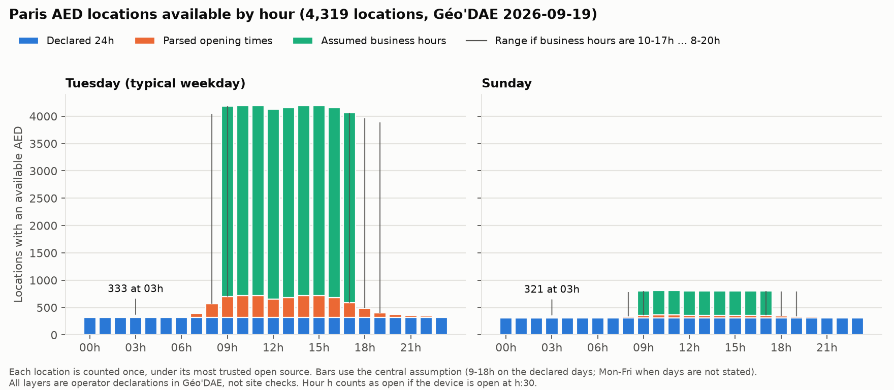

# Step 2: availability per hour

Input: the clean set from step 1 (4,703 devices, 4,319 locations).
Script: `scripts/02_availability.py`; parser: `aednight/hours.py`, tests: `tests/test_hours.py` (44 passing).
Per-device output: `data/interim/availability.csv`, with three 168-hour strings (Mon 00h … Sun 23h)
for the central, low and high assumptions.

**Rule:** an hour *h* counts as open if the device is open at *h*:30.
"9h/18h" → hours 9–17; "20h/8h" wraps past midnight into the next day.

## Where each device's hours come from

| Basis | Devices | Locations | Status |
|---|---|---|---|
| `declared_24_7`: structured fields, 24h/24 every day | 340 | 306 | declared |
| `declared_24h_days`: 24h/24 on listed days | 13 | 12 | declared |
| `parsed_text`: explicit times in free text | 446 | 414 | declared, read by the parser |
| `assumed_business`: "heures ouvrables" only | 3,787 | 3,493 | **ESTIMATE** |
| `assumed_night`: "heures de nuit" only, set to 20h–8h | 3 | 3 | **ESTIMATE** |
| `none`: events only, or nothing stated → treated as never available | 114 | 105 | conservative |

"Declared" means the operator declared it. It is not a site check.

**Parser.** 447 devices have times in free text: 414 parsed from `c_disp_complt` plus 32 more found in
`c_acc_complt`, the access-notes field; 446 parsed in total and 1 failed ("ouvert à partir de 11h", which has
no closing time) and falls back to the assumption. That is 284 distinct strings in total.
All readings are listed in `outputs/02_parse_audit.csv`, and I reviewed them by hand.
Two strings are hand-transcribed overrides (in `OVERRIDES`) because the grammar would misread them.

**Assumptions (ESTIMATES):**
- "Heures ouvrables" = 9h–18h on the declared days. The sensitivity range is 10h–17h (low) to 8h–20h (high).
- When the days are "non renseigné", the days are assumed to be Mon–Fri. This affects 639 assumed-business devices.
- `7j/7` + "heures ouvrables" is taken literally: every day, business window.
- Free text overrides the structured day list when they disagree.

## Results: locations with an available AED

| | 03h | 08h | 09h | 12h | 17h | 18h | 19h | 20h |
|---|---|---|---|---|---|---|---|---|
| **Tuesday, central** | **333** | 568 | 4,180 | 4,128 | 4,067 | 485 | 407 | 381 |
| Tuesday, low–high range | 333 | 568–4,044 | 704–4,180 | 4,128 | 591–4,067 | 485–3,961 | 407–3,883 | 381 |
| **Sunday, central** | **321** | | | 807 | | | | |

- **The 3am figure does not depend on the business-hours assumption.** At Tuesday 3am, 333 locations
  are open. 318 of them are declared 24h (306 are 24/7 every day), 9 come from parsed night hours,
  and 6 are assumed night windows. The low, central and high bands give identical counts at night.
- **Strict night scenario** (open AND (outdoor OR marked freely accessible)): 226 locations at
  Tuesday 3am, 217 at Sunday 3am.
- 52 of the 333 locations open at 3am carry a *conditional-access* flag: their text says staff only,
  badge, intercom, guard, "selon présence", etc. They are kept but flagged.
  The strict scenario does **not** remove them yet (see decision below).
- **The daytime shape is mostly assumption.** Between 9h and 17h on a weekday, 83–84% of open
  locations rest on the assumed window. The steep edges at 8–9h and 17–19h are an artefact of that
  window, as the whiskers in the figure show. So the daytime numbers, and any day-vs-night ratio,
  must be reported as a range, not a point.
- **Sunday is thin even in daytime:** 807 locations at noon, because most devices declare Mon–Fri.

## Limits carried forward
- Declared hours are not verified; nothing here says a device is reachable in practice.
- Station hours matter: 5 Gare de Lyon/Bercy devices declare "open 4h to 1h30" (or 4h30 to 1h), so they are closed at 3am.
- Hours can change with holidays or seasons ("hors vacances scolaires", "hors août"). This grid is one typical week.

## Open decision for step 3
Should the strict night scenario also exclude the 52 conditional-access locations?
The step-1 definition doesn't, but a device behind a badge or a staffed-only intercom is doubtful at 3am.
