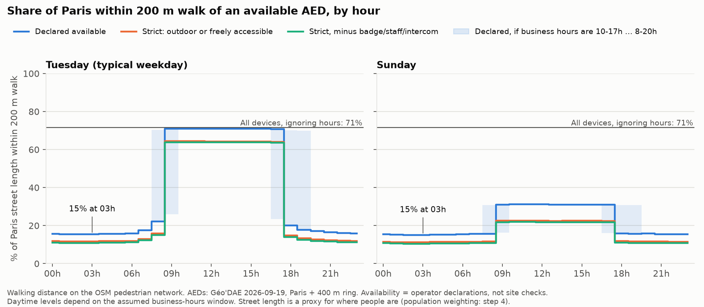
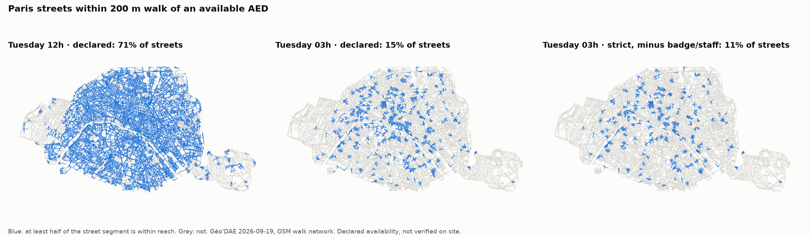

# Step 3: walking coverage for every hour

Script: `scripts/03_coverage.py` (network code: `aednight/network.py`). Graph: `scripts/00_fetch_walk_graph.py`.
All 168 hours × 3 access scenarios × 3 business-hour bands × 4 distance thresholds are in
`outputs/03_coverage_hourly.csv`.

## Method

- **Network.** OSM pedestrian graph (osmnx 2.1.1, `network_type="walk"`), downloaded 2026-09-19 for
  Paris plus a 400 m buffer. It has 89,541 nodes; 77,294 are inside Paris, with 3,943 km of walkable
  links inside Paris. It is treated as undirected, keeping the shortest of any parallel edges. Projection is Lambert-93.
- **Supply.** 4,928 clean AED locations: 4,319 in Paris plus 609 in a 400 m ring outside, cleaned with
  the same rules. Each location is snapped to its nearest graph node, and the straight-line snap distance
  is **added** to every walk, so AEDs never look closer than they are. Snap distance: median 22 m,
  90th percentile 51 m, 99th percentile 93 m. The largest snaps are ring devices at the edge of the clipped graph.
- **Distance.** Multi-source Dijkstra from the locations open in a given hour. This was cross-checked
  against an independent networkx run for Tuesday 3am: node coverage and every distance within 200 m
  matched exactly (maximum difference 6·10⁻¹⁴ m).
- **Primary metric.** Share of Paris **street length** within 200 m walking of an open AED.
  Each street segment is credited only with the metres actually within reach from either end.
  **Secondary metric:** share of graph nodes, comparable with the OSM prototype's "intersections".
  Both are geographic proxies for where people are; step 4 weights by population.
- **Access scenarios**, applied at every hour:
  - `declared`: open per step 2
  - `strict`: open AND (outdoors OR marked freely accessible)
  - `strict_unconditional`: strict, minus devices whose text mentions a badge, staff only, an intercom, a guard, etc.
  - `reference_all`: every device, ignoring hours
- **Bands.** The central, low and high bands change only the devices whose hours are assumed.
  At night they give identical results.

## Results (200 m)

Street share is the primary metric; node share is in brackets.

| | Tue 03h | Tue 12h | Sun 03h | Sun 12h |
|---|---|---|---|---|
| **declared** | **15.5%** (18.4%) | 70.9% (78.2%) | 15.1% | 31.2% |
| **strict** | **11.6%** (14.1%) | 64.3% (72.0%) | 11.2% | 22.5% |
| **strict_unconditional** | **10.9%** (13.2%) | 63.8% (71.5%) | 10.5% | 21.7% |
| reference_all (ignores hours) | 71.5% (78.8%) | | | |

**Status of each number:**
- **Night values are computed from declared and parsed hours only.** They don't depend on my
  business-hours assumption, but they are only as true as the operators' declarations.
- **Daytime values are ESTIMATES.** They rest on the assumed 9h–18h window. At Tuesday 9h, the declared
  coverage is 71.0% with 9h–18h but 25.9% with 10h–17h. The steep morning and evening edges in the chart
  are the assumption's shape, not data.
- **Day/night ratio (Tuesday noon vs 3am):** about 4.6× for declared, 5.9× for strict_unconditional.
  Report this as an estimate, because the daytime side is assumption-heavy.
- **Sunday daytime is low (31%)** because most devices declare Monday–Friday. Where the days were unstated,
  I assumed Mon–Fri; that assumption lowers Sunday coverage.

**Sensitivity to the walking threshold** (street share, declared, Tuesday):

| threshold | 100 m | 200 m | 300 m | 400 m |
|---|---|---|---|---|
| 03h | 4.1% | 15.5% | 31.7% | 48.6% |
| 12h | 33.1% | 70.9% | 85.6% | 91.0% |

The night gap is the robust result. Even at 400 m, less than half of Paris street length has a declared night-available AED.

**The ring matters little overall.** With Paris-only supply, Tuesday 3am declared coverage is 15.4%
instead of 15.5%, and reference_all is 70.9% instead of 71.5%. It matters locally near the
périphérique, which is why it's kept for step 5.

**Comparison with the OSM prototype** (node share; context only, because the data and definitions differ).
With all devices, coverage goes from 43% (OSM) to 78.8% (Géo'DAE). At night it goes from 7%
("OSM outdoor or 24/7") to 13.2–18.4% (strict_unconditional to declared). The gap is smaller than the
prototype suggested, but it is still large.

## Limits
- Walk distance to the building entrance is not the same as retrieval time. Indoor devices, floors
  and locked doors are not modelled beyond the access scenarios.
- Street length over-weights large parks: the Bois de Boulogne and Bois de Vincennes are mostly grey,
  even at noon. It also over-weights areas where OSM maps sidewalks as separate footways.
  Step 4 corrects this with population weighting.
- OSM and Géo'DAE are snapshots from 2026-09-19; OSM changes continuously.
- Nearest-node snapping adds the snap distance on top of the walk, which slightly overstates walk
  distances for AEDs in the middle of a long block.
