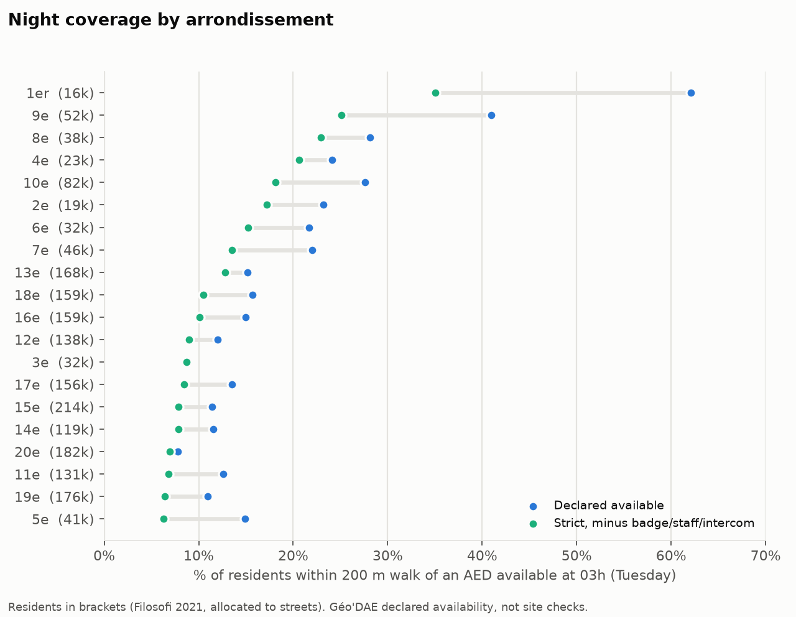
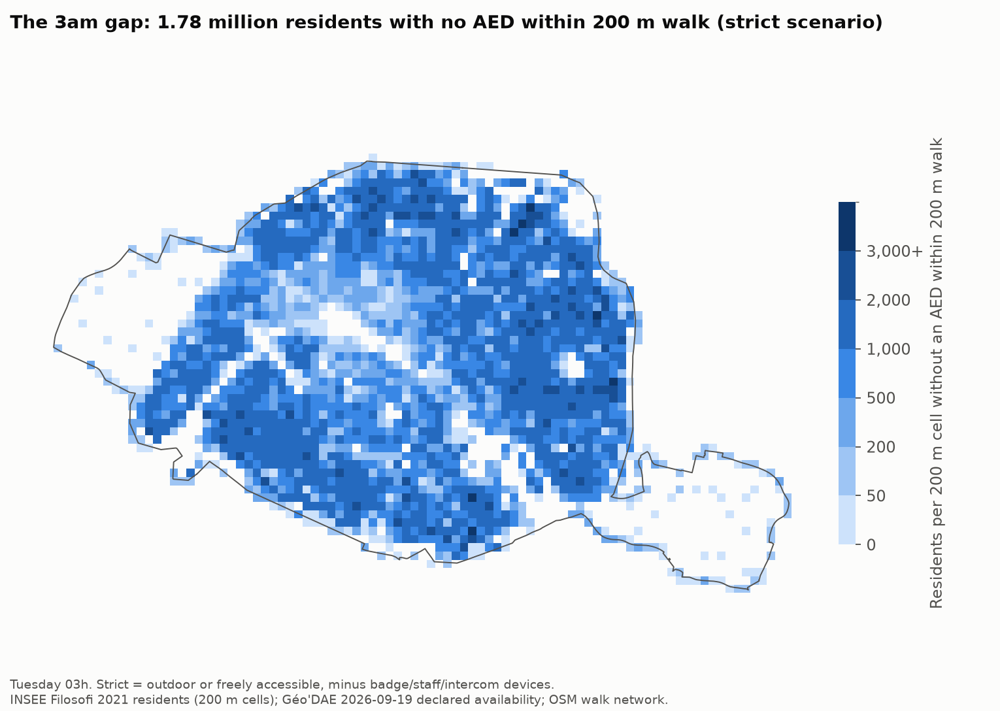

# Step 4: population-weighted coverage

Script: `scripts/04_population.py` (figures: `scripts/fig_04.py`).
Outputs: `04_population_coverage_hourly.csv` (all 168 hours × scenario × band × threshold),
`04_arrondissement_coverage.csv`, `04_population.json`.

## Population dataset (verified 2026-09-19)

- **INSEE, "Revenus, pauvreté et niveau de vie en 2021 – Données carroyées", 200 m cells including imputed cells.**
  Published 2026-02-16; reference year 2021. This is the newest 200 m grid.
  - Page: https://www.insee.fr/fr/statistiques/8735162
  - File: `Filosofi2021_carreaux_200m_csv.zip` (sha256 `5935efb1…a8a3`)
  - Documentation: https://www.insee.fr/fr/statistiques/fichier/8735106/documentation_donnees-carroyees_filosofi2021.pdf
- The census grid (RP 2021, published 2024-10-17) exists only at 1 km, so it is too coarse for 200 m walks.
- The variable used is `ind`, the number of individuals. The documentation says it is the one variable
  released unaltered, even in imputed cells. In Paris, only 0.3% of residents sit in imputed cells.
- **Scope.** Filosofi counts people in fiscal households. It **excludes** people in collective housing
  (care homes, shelters, workers' hostels, prisons) and homeless people. Adult students attached to
  their parents' tax return are counted at the parents' address, so students are under-counted in Paris.
  Per INSEE, the total must not be compared with the census. Here it is 1.98 M on Paris streets;
  the census gives about 2.1 M.

## Method

- **Allocation (dasymetric).** Each 200 m cell's residents are spread evenly over the walkable street
  length whose midpoint falls in that cell (cell grid in EPSG:3035, as INSEE defines it).
  A street segment's covered residents = residents × the fraction of its length within reach (step 3).
- **Edge cases:**
  - 111 cells with residents but no street midpoint (67,538 residents) go to the nearest street, at most 199 m away.
  - Cells outside the downloaded network were dropped. None of them has a Paris code.
- **Effect of the weighting.** 17.7% of Paris street length now carries **zero** residents
  (the two Bois, rail yards, the périphérique). They no longer count as "uncovered".
- **Check:** a second allocation, spreading residents over graph nodes instead of street length,
  is within about 1–3 points everywhere (see the table).

## Results: residents within 200 m walk of an available AED

| | Tue 03h | Tue 12h | Sun 03h | Sun 12h |
|---|---|---|---|---|
| **declared** | **15.2%** (300k) | 83.5% | 14.7% | 34.5% |
| **strict** | **11.1%** (220k) | 76.5% | 10.7% | 24.4% |
| **strict_unconditional** | **10.4%** (205k) | 76.1% | 9.9% | 23.7% |
| all devices, ignoring hours | 84.0% | | | |
| node allocation (check), declared | 16.2% | 85.9% | | |

**Status of each number:**
- **Night values:** computed from declared and parsed hours only; the business-hours assumption doesn't affect them.
  At Tuesday 3am, **1.68–1.78 M of 1.98 M residents** (declared to strict_unconditional) have no available
  AED within a 200 m walk.
- **Daytime values are ESTIMATES**, for two reasons. The hours of most devices are assumed
  (at Tue 9h the declared share is 27.7% with a 10h–17h window vs 83.6% with 9h–18h). And residents are the
  wrong denominator by day: this counts residents within reach, not the people actually present.
- **Day/night ratio for residents (Tue noon vs 3am):** 5.5× declared, 7.3× strict_unconditional. This is an estimate.
- **Threshold sensitivity** (Tue 03h, share of residents):

  | | 100 m | 200 m | 300 m | 400 m |
  |---|---|---|---|---|
  | declared | 3.9% | 15.2% | 32.3% | 51.7% |
  | strict | 2.8% | 11.1% | 24.7% | 41.0% |
  | strict_unconditional | 2.6% | 10.4% | 23.0% | 38.5% |

- **Compared with step 3.** Night coverage is almost unchanged (15.2% of residents vs 15.5% of street length).
  Daytime coverage rises from 71% to 84%, because the uncovered Bois have no residents.
  In other words, night-available AEDs are no more concentrated where people live than streets in general, whereas daytime supply is.

**By arrondissement** (Tue 03h, declared → strict_unconditional):
- The highest is the 1st: 62% → 35% (16k residents).
- The lowest are large residential arrondissements: the 20th (7.8% → 6.9%, 182k), 19th (11% → 6.4%, 176k), 11th (12.6% → 6.8%) and 15th (11.4% → 7.9%, 214k).
- 9 of 20 arrondissements are below 10% under strict_unconditional.
- The 5th loses the largest share of its coverage between scenarios (15% → 6.3%): most of its night supply is indoor or conditional access.

## Limits
- Filosofi places residents at their cadastral parcel, but the allocation assumes they are spread
  evenly along the streets of their cell. At 200 m scale this can be off by up to about 100 m, which
  matters against a 200 m threshold. The node-allocation check moves results by about 1 point, but that
  is not a bound on this error.
- Filosofi excludes collective housing and homeless people, so residents of care homes and shelters
  are not represented at all. This analysis doesn't estimate their risk.
- The model assumes people start from a street. Retrieval time (fetching the AED, stairs, door codes)
  and the chance that a bystander is there are not modelled.
- Filosofi 2021 residents are combined with a 2026 AED snapshot.
