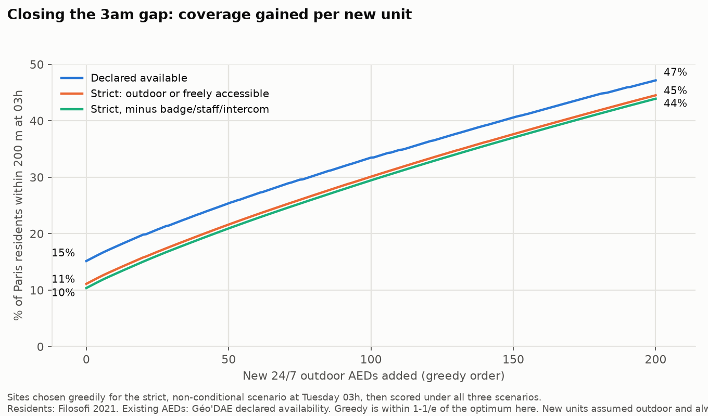
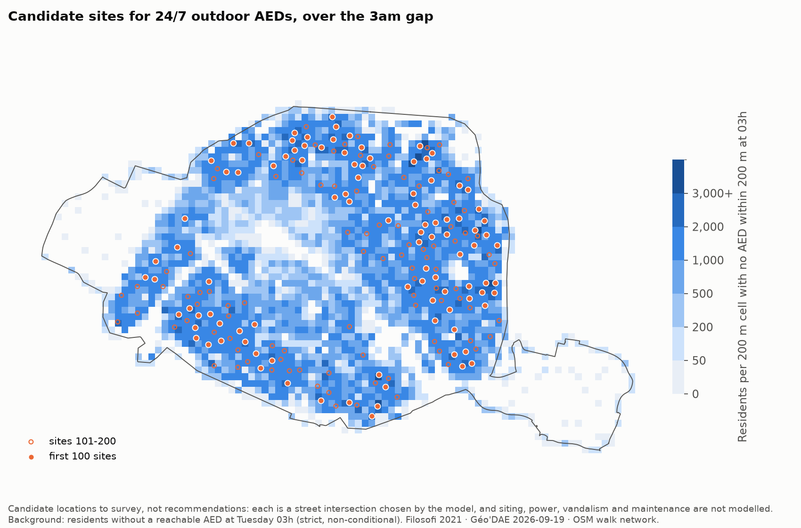

# Step 5: where new 24/7 outdoor units would help most

Script: `scripts/05_greedy_sites.py` (figures: `scripts/fig_05.py`).
Ranked list: `outputs/05_proposed_sites.csv` (200 sites with addresses); summary: `05_greedy.json`.

**These are candidate locations to survey, not recommendations.** Each is a street intersection picked by
the model. Siting, power, vandalism, maintenance contracts, pavement width, and whether the spot is
already covered by a nearby building's device at night are all outside the model.

## Method

- **Objective:** maximise residents within a 200 m walk of an AED available at **Tuesday 03h**, under the
  **strict, non-conditional** scenario (outdoor or freely accessible, excluding badge/staff/intercom devices).
  Residents come from the step-4 allocation of Filosofi 2021 to streets.
- **New units** are assumed outdoor and always available, so they also count under the declared and strict
  scenarios. The same chosen sites are scored under all three.
- **Candidates:** all 77,294 walk-graph nodes inside Paris.
- **Greedy with a guarantee.** The objective is monotone submodular, so greedy selection is within
  (1 − 1/e) ≈ 63% of the best possible set of that size, and lazy (CELF) evaluation gives the same answer as
  the plain greedy.
- **Addresses** come from the French national address base (BAN, api-adresse.data.gouv.fr); only the site
  coordinates are sent. The address point is a median of 8 m from the site (maximum 24 m).

**Verification.** Coverage after 1, 10, 25, 50, 100 and 200 sites was recomputed from scratch with an
independent Dijkstra run: identical to 4 decimal places. A brute-force search over all 77,294 candidates
confirms the first greedy pick is the best possible single site.

## Results

Share of Paris residents within 200 m at Tuesday 03h:

| New units | strict_unconditional | strict | declared | Residents gained (est.) |
|---|---|---|---|---|
| 0 (today) | 10.4% | 11.1% | 15.2% | — |
| +25 | 16.1% | 16.8% | 20.7% | 114,000 |
| +50 | 20.9% | 21.6% | 25.4% | 209,000 |
| +100 | 29.4% | 30.1% | 33.5% | 378,000 |
| +200 | 43.9% | 44.5% | 47.2% | 665,000 |

- Returns fall slowly: the 25th unit adds about 4,100 residents, the 100th about 3,200, the 200th about 2,600.
  There is no sharp cut-off point; the curve is close to linear over this range.
- Even 200 new units leave **more than half of residents** without a night-available AED within 200 m.
  Closing the gap fully is not a matter of a few dozen units.
- **Comparison with the OSM prototype** (which measured intersections): +50 → 18%, +100 → 26%.
  The population-weighted figures here are +50 → 21%, +100 → 29%. Similar magnitude, different definitions.

**Where the sites fall** (of 200): 15th 26, 20th 25, 19th 23, 11th 22, 18th 19, 17th 18, 13th 15, 12th 12.
These are the dense residential arrondissements that step 4 showed to be worst covered at night.

**Top 10 candidate sites**

| # | Address | Residents gained (est.) | Nearest existing AED |
|---|---|---|---|
| 1 | 98 Rue de l'Ourcq, 75019 | 5,224 | 87 m |
| 2 | 2 Rue Archereau, 75019 | 5,216 | 25 m |
| 3 | 116 Avenue de Flandre, 75019 | 5,176 | 52 m |
| 4 | 20 Avenue d'Ivry, 75013 | 5,120 | 8 m |
| 5 | 35 Rue de Reuilly, 75012 | 4,987 | 51 m |
| 6 | 20 Rue du Télégraphe, 75020 | 4,981 | 57 m |
| 7 | 2 Rue Morand, 75011 | 4,688 | 35 m |
| 8 | 4 Boulevard Ornano, 75018 | 4,565 | 11 m |
| 9 | 90 Rue Saint-Blaise, 75020 | 4,500 | 177 m |
| 10 | 99 Avenue de Clichy, 75017 | 4,479 | 119 m |

## How much to trust individual sites

- **The areas are robust; the exact corners are not.** Rerunning the greedy with the alternative population
  allocation (residents spread over intersections instead of street length) reproduces only
  **14 of the top 25**, 24 of 50, 53 of 100 and 108 of 200 sites within 100 m. Treat the list as a ranked set
  of neighbourhoods to survey, not as 200 specific street corners.
- **146 of the 200 sites are within 100 m of an AED that already exists** (54 within 50 m). For 142 of those the
  existing device is on daytime hours (133 assumed, 9 parsed); 2 declare 24/7 but are indoor or conditional-access,
  and 2 have no usable hours. For those, making the existing device reachable at night — an outdoor
  cabinet, or 24/7 access — may be cheaper than a new unit. This analysis does not cost either option.
- Sites are chosen for one hour (Tuesday 03h). Because the night supply barely changes across the night
  and across days, the ranking would be similar for other night hours, but this was not rerun for each hour.

## Limits carried forward
- Everything rests on **declared** availability in Géo'DAE, which is not verified on the ground.
- Coverage counts a walkable distance, not a retrieval time or a survival outcome. No claim is made here about
  lives saved: that would need cardiac-arrest incidence, bystander behaviour and response-time models that
  this project does not use.
- Residents exclude collective housing (care homes, shelters) and homeless people (step 4).
- The objective uses residents, so it favours dense housing over places where people gather at night
  (stations, nightlife streets, hospitals' surroundings). A night-time presence layer would change the ranking.
